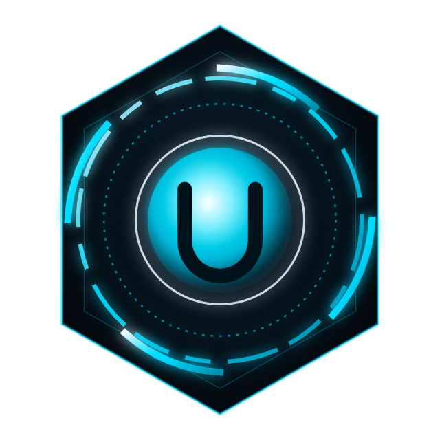

<p align="center"></p>

# ULTRON

**A desktop AI command center for Windows.** An animated HUD you talk to, with a team of seven AI agents behind it. They work in parallel: they browse the web, research, work with your files (asking first), run your connected apps, and remember what matters.

You bring the AI. Ultron runs on your choice of:

- **Google Gemini:** a free key, and the easiest start.
- **Claude (Anthropic).**
- **An OpenAI-compatible service:** OpenAI, OpenRouter, Groq, DeepSeek, or LM Studio on your own PC.
- **A local model through Ollama:** free and private.

You also choose which apps it may use.

> Windows 10 or 11 (64-bit). Some features (PC control, Spotify control, secure key storage) are Windows-only.

---

## What it does

- **Talks and listens.** Type, or hold <kbd>Space</kbd> to speak. Say "Ultron" to wake it, if you turn that on. It answers out loud.
- **A team of seven.** One lead and seven specialists:

  | Agent | Job |
  |---|---|
  | Athena | Plans and thinks |
  | Argus | Research and browsing |
  | Hephaestus | Your PC and files |
  | Hermes | Your apps |
  | Chronos | Tasks and reminders |
  | Mnemosyne | Memory |
  | Daedalus | Builds on websites |

  The lead brings in whoever a job needs. Their work shows live in the HUD.
- **Memory.** Everything important goes into a Markdown vault on your PC (`~/Ultron Vault`, which you can open in Obsidian). Each fact records where it came from. You can correct or delete anything.
- **Your apps, your choice.** Gmail, Google Calendar, Docs, Sheets, Drive, Notion, GitHub, Canva, Figma, YouTube, Instagram and more, through [Composio](https://composio.dev). You connect only the ones you want.
- **Research and the web.** A hidden browser reads pages, searches, and writes cited research briefs.
- **Checks its own work.** It computes numbers instead of guessing them, checks citations against their sources, and says plainly when it doesn't know.
- **Tasks and reminders**, with Windows notifications.
- **Your own Discord bot.** It can manage channels, roles and messages in a server you own.
- **Spotify on this PC:** play, pause, skip, and "what's playing". This works with Spotify Free.
- **Optional add-ons:**
  - an autonomous browser agent (browser-use);
  - YouTube transcripts and RSS feeds;
  - a second, learning memory (Hindsight);
  - 170 science and brainstorming guides the agents look up by themselves.

**It asks before it does anything that matters:** sending, posting, deleting, or changing files or settings. It never types your passwords, buys anything, creates accounts, or tries to get past CAPTCHAs.

---

## Install it on a new computer

### 1. Download and install

1. Go to the **[Releases](https://github.com/Shae1234567/ultron-assistant/releases/latest)** page and download **`Ultron-Setup-<version>.exe`**.
2. Run it. It installs for your Windows user only and needs no admin rights.
3. **Windows may say "Windows protected your PC".** This installer isn't code-signed, because signing certificates cost money. Click **More info**, then **Run anyway**. You can also check the code yourself; it's all in this repository.

Ultron opens when the install finishes. On its first start it also downloads the browser its agents use (Chromium, about 150 MB) in the background.

### 2. First-time setup (about 3 minutes)

Ultron opens with a short setup:

1. **About you.** Your name, your city (for weather and local news), and whether you're under 18.
   - Under 18: Ultron stays a tool, not a companion, and it teaches schoolwork instead of writing it for you to hand in.
2. **Your AI.** Pick one and paste its key:

| Choice | Where to get a key | Cost |
|---|---|---|
| **Gemini** (recommended to start) | [aistudio.google.com/apikey](https://aistudio.google.com/apikey): sign in with Google, then **Create API key** | Free tier, with daily limits |
| **Claude** | [console.anthropic.com](https://console.anthropic.com/settings/keys) | Pay per use, so the account needs credit |
| **OpenAI-compatible** | OpenAI: [platform.openai.com/api-keys](https://platform.openai.com/api-keys) · OpenRouter: [openrouter.ai/keys](https://openrouter.ai/keys) (some models are free) · Groq: [console.groq.com/keys](https://console.groq.com/keys) · DeepSeek · or **LM Studio** on your PC (no key) | Depends on the service |
| **Local (Ollama)** | No key. Install [Ollama](https://ollama.com/download), then Settings → *Local model setup* → download `qwen3.5:4b` (3.4 GB) | Free, but needs a decent graphics card (6 GB or more) and is much less capable |

   Keys are checked when you press **Finish**, and stored encrypted by Windows on your PC. You can switch AI any time in **Settings → Brain**. There, *Automatic* uses the first provider with a key: Gemini, then Claude, then OpenAI-compatible. If Ollama is installed, it's the backup.

3. **Your apps** (optional). You can skip this and do it later.

### 3. Connect your apps (optional)

1. Open the **Apps** panel and press **Sign in with Composio**. Make a free Composio account if you don't have one.
2. Press **Connect** next to each app you want Ultron to use, and sign in to that app in the window that opens.
3. Ask things like "what's on my calendar tomorrow?", "draft an email to my coach saying I'll be late", or "make a Google Doc with a study plan for Friday's test".

Some apps have limits:
- **Instagram** works only with a *Creator* or *Business* account. Switching is free: Instagram → Settings → Account type and tools.
- **Spotify** through Composio needs Spotify Premium and your own Spotify developer app. With Spotify Free, use the built-in Spotify control instead ("pause the music", "skip this song").

### School: D2L Brightspace (optional)

If your school uses D2L Brightspace, Ultron can tell you what's due, your grades and announcements, and turn due dates into reminders.

1. Open the **Apps** panel and find **D2L Brightspace - School**.
2. Type the address you open D2L at, for example `myschool.brightspace.com`. Copying the whole address from your browser's top bar works too.
3. Press **Sign in to D2L**. A D2L window opens: sign in with your school account as usual, including any 2-step check.

Ultron never sees your password. It keeps the signed-in session, so you stay signed in after closing it. Then ask things like "what's due this week?" or "any new announcements?".

### 4. Your own Discord bot (optional)

Ultron can manage a Discord server you own through **your own private bot**:

1. In the [Discord Developer Portal](https://discord.com/developers/applications), press **New Application** and call it *Ultron*.
2. On the **Installation** page, set *Install Link* to **None**.
3. On the **Bot** page:
   - turn **Public Bot** off;
   - turn on **Server Members Intent** and **Message Content Intent**, then **Save**;
   - press **Reset Token** and copy the token.
4. In Ultron, go to **Apps → Discord - your own bot**, paste the token, press **Save & test**, then **Add bot to a server**.

Treat the token like a password. Discord's developer terms need a parent's okay for anyone under 18.

### 5. Add-ons (optional)

The extra abilities need Python tools. A script installs them into `%USERPROFILE%\UltronTools`, each in its own isolated environment with tested versions:

1. Install **uv**, which fetches Python by itself. In PowerShell run `winget install --id astral-sh.uv -e`, then open a new PowerShell window.
2. Download [`install-addons.ps1`](https://github.com/Shae1234567/ultron-assistant/raw/main/scripts/install-addons.ps1) (right-click, then Save link as) and run it from the folder you saved it in:

   ```powershell
   powershell -ExecutionPolicy Bypass -File install-addons.ps1
   ```

   Or install only some of them: `install-addons.ps1 youtube skills`. The parts are:

   | Part | What it adds | Needs |
   |---|---|---|
   | `browser` | [browser-use](https://github.com/browser-use/browser-use), for long jobs on one website | |
   | `youtube` | yt-dlp and feedparser (from [Agent-Reach](https://github.com/Panniantong/Agent-Reach)): video transcripts and RSS | [Node.js](https://nodejs.org) for YouTube |
   | `memory` | [Hindsight](https://github.com/vectorize-io/hindsight) | Ollama; about 1 GB of RAM while on |
   | `skills` | [Scientific Agent Skills](https://github.com/K-Dense-AI/scientific-agent-skills) and [Lateral Thinking](https://github.com/danium/lateral-thinking) | |

3. Restart Ultron. **Apps → Add-ons** shows what's installed. Ultron picks the right add-on by itself; you never have to name it.

---

## Using it

- **Talk or type.** Click the box and type, or hold <kbd>Space</kbd> and speak. Ultron replies out loud; Settings → Voice changes the voice or mutes it.
- **Watch the team.** The activity log shows each agent's plan, the tools they use, and what they checked.
- **Approvals.** When an agent wants to send, post, delete or change something, a card appears. Nothing happens until you press **Approve**.
- **Settings:**
  - **Team mode:** *Auto* is fast and brings in agents only when needed; *Full* always plans with the whole team.
  - **Thinking:** Deep, Balanced or Fast.
  - **Per-request limits** on AI calls, tokens and minutes.
  - **Research depth**, voice, news, and start with Windows.
- **Memory.** Open the Memory panel, or the `~/Ultron Vault` folder in [Obsidian](https://obsidian.md), to read and edit what Ultron knows. Say "forget that…" to remove a fact.

Things to try:

- "What's the weather this weekend, and should I bring a jacket to practice on Saturday?"
- "Research the causes of the fall of the Roman Empire and give me a cited brief."
- "I need ideas for a name for my YouTube channel." (It brainstorms with a real technique.)
- "Remind me at 7 pm to pack my bag."
- "Tidy up my Downloads folder." (It asks before it moves anything.)

---

## Privacy and safety

- **Stays on your PC:**
  - settings (`%APPDATA%\Ultron`);
  - your memory vault (`~/Ultron Vault`);
  - your API keys, encrypted with Windows' own protection (DPAPI).
- **Leaves your PC:**
  - what you ask, sent to the AI provider you chose;
  - app requests to Composio, and to the apps you connected;
  - the web pages the agents visit.

  If you choose the local model, your conversation stays on the PC. Ultron has no server and collects nothing.
- **Guard rails, built into the code:**
  - approval cards for anything that sends, posts, deletes or changes things;
  - no typing passwords, purchases, account creation or CAPTCHA solving by the agents;
  - web pages are treated as information, never as instructions;
  - secrets are removed before anything is written to memory.

---

## Build from source (developers)

Requirements: Windows, [Node.js](https://nodejs.org) 20 or newer, and Git.

```powershell
git clone https://github.com/Shae1234567/ultron-assistant.git
cd ultron-assistant
npm install          # also downloads Playwright's Chromium
npm run dev          # the app, with hot reload
npm test             # the test suite (vitest)
npm run package      # installer in release\
```

If `npm install` was run with install scripts turned off, finish the setup with `node node_modules/electron/install.js` and `npx playwright install chromium`.

**Project layout:**
- `electron/`: the main process.
  - `brain/`: the agents, tools and prompts.
  - `brain/llm.ts` and `brain/providers/`: the AI providers.
  - `memory/`: the vault.
  - `composio.ts`: the apps.
- `src/`: the React HUD.
- `pytools/`: the Python add-on bridges.

---

## Troubleshooting

| Problem | Fix |
|---|---|
| "No AI set up yet" | Settings → Brain: pick a provider and paste its key, then press Save. |
| Gemini says a limit is used up | The free tier has per-minute and daily limits. Wait, add another provider (Automatic switches to it), or install Ollama as a backup. |
| "Windows protected your PC" | The installer isn't code-signed. Click **More info → Run anyway**. |
| Web tasks fail on the first day | The agents' browser (Chromium) is still downloading in the background. Try again in a few minutes. |
| An app says "needs setup" | Some apps (Spotify, TikTok) have no ready-made Composio login and need your own developer app. The Apps panel links to the setup. |
| Slow replies | Settings → Team → **Auto**, and Settings → Thinking → **Balanced** or **Fast**. |

---

## Credits

Built with:
- [Electron](https://www.electronjs.org), [React](https://react.dev) and [Vite](https://vitejs.dev);
- [Playwright](https://playwright.dev) and [Mozilla Readability](https://github.com/mozilla/readability);
- [QuickJS](https://github.com/justjake/quickjs-emscripten), [mathjs](https://mathjs.org), the [CortexJS Compute Engine](https://cortexjs.io/compute-engine/) and [MiniSearch](https://github.com/lucaong/minisearch);
- [Composio](https://composio.dev);
- the [Anthropic SDK](https://github.com/anthropics/anthropic-sdk-typescript) and [Google Gen AI SDK](https://github.com/googleapis/js-genai).

The optional add-ons are MIT-licensed projects by their authors, linked above.

## License

[MIT](LICENSE). Use it, change it, share it.
